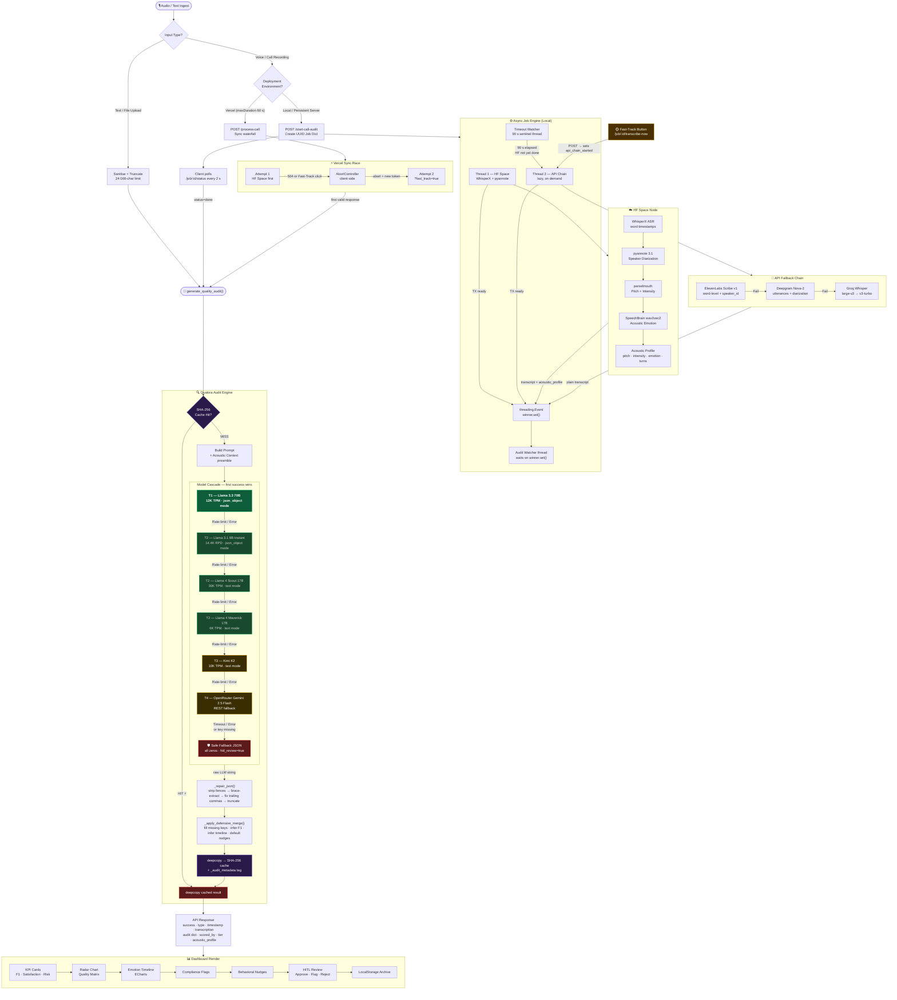

<div align="center">
  
  <h1>Qualora</h1>
  <p><strong>Turn every conversation into structured intelligence.</strong></p>
  <p><em>An enterprise-grade AI auditing platform that transcribes, analyzes, and scores support interactions — across voice, text, and file — with zero single point of failure.</em></p>

  [](#)
  [](#)
  [](#)
  [](#)
  [](#)
</div>

---

## 📋 Table of Contents

1. [Project Overview](#-project-overview)
2. [Key Capabilities](#-key-capabilities)
3. [System Architecture](#-system-architecture)
4. [Technology Stack](#-technology-stack)
5. [Getting Started](#-getting-started)
6. [Hugging Face Space Node Setup](#-hugging-face-space-node-setup)
7. [Deploying to Vercel](#-deploying-to-vercel)
8. [API Reference](#-api-reference)
9. [The LLM-as-a-Judge Audit Matrix](#-the-llm-as-a-judge-audit-matrix)
10. [Troubleshooting](#-troubleshooting)
11. [Roadmap](#-roadmap)

---

## 🌟 Project Overview

**Qualora** is a cutting-edge AI quality auditing platform designed to process, transcribe, and analyze omnichannel customer support interactions. Built for **robustness and speed**, it employs a **Distributed Hybrid "Race" Architecture**: requests execute in parallel across a free, on-premise Hugging Face Space (performing deep acoustic analysis and diarization) *and* a high-speed API fallback chain (ElevenLabs → Deepgram → Groq). The fastest valid response wins, guaranteeing **100% uptime and minimal latency**.

The platform ingests audio or text, performs deep acoustic profiling (pitch, intensity, emotion detection), transcribes via competitive asynchronous execution, and utilizes an **LLM-as-a-Judge framework** to score agents on empathy, bias reduction, resolution efficiency, and compliance — with behavioral coaching nudges grounded in conversation context.

---

## ✨ Key Capabilities

1. 🎙️ **Multi-Speaker Recognition & Acoustic Profiling**  
   Pyannote speaker diarization combined with SpeechBrain extracts voiceprints, detects elevated acoustic stress (pitch/intensity), and classifies physiological emotion directly from the audio envelope.
   
2. 🤖 **Competitive Asynchronous Transcription**  
   Simultaneous execution across free-tier compute (HF Space) and premium APIs. Graceful degradation and zero single points of failure.  

3. ⚖️ **LLM-as-a-Judge Auditing**  
   Evaluates conversations using Llama 3.3 70B to output a structured JSON matrix: Agent F1 Score, Emotional Timeline, compliance risk flags, and psychologically grounded behavioral nudges.

4. 📊 **Seamless UI & History Archive**  
   Vanilla JavaScript frontend with responsive Material Design 3 styling. Features real-time job polling, audio playback, and persistent local history archiving.

5. 🚀 **Omnichannel Input**  
   Voice uploads (MP3, WAV, M4A, WebM), live browser recording, text transcripts, and file uploads (TXT, PDF).

---

## 🏛️ System Architecture

Qualora leverages a **master-worker pattern** where the Flask application orchestrates long-running transcription tasks through asynchronous job queueing.

### The Distributed Hybrid "Race"

When a file is uploaded, an async job is spawned inside the Flask backend:

- **Thread A (The HF Space Node):** The file is streamed to a private Hugging Face Space running `faster-whisper` (int8), `pyannote/speaker-diarization-3.1`, and `speechbrain` for acoustic profiling.
- **Thread B (The API Fallback Chain):** The file traverses a waterfall sequence: **ElevenLabs Scribe** → **Deepgram Nova-2** → **Groq Whisper-large-v3** (each attempted only on prior failure).

The **first thread to successfully return a full transcript wins** and locks the job. Once resolved, the **LLM Auditor** kicks in, injecting acoustic context and the actual transcript into a structured prompt to ground textual evaluation in biometric reality.

### Workflow Sequence Diagram


---

## 🛠️ Technology Stack

| Layer | Technologies |
|---|---|
| **Frontend** | Vanilla HTML5, CSS3 (Material Design 3), JavaScript ES6+, Fetch API |
| **Backend** | Python 3.10+, Flask, Threading, asyncio, Gradio Client |
| **ASR (On-Premise/HF Space)** | `faster-whisper` (int8 quantization), `pyannote/speaker-diarization-3.1` |
| **Acoustic Analytics** | `speechbrain` (wav2vec2 emotion), `parselmouth` (Praat pitch/intensity) |
| **External APIs** | ElevenLabs (Scribe), Deepgram (Nova-2), Groq (Whisper + Llama 3) |
| **LLM Auditor** | Groq Llama 3.3 70B (T1), Llama 3.1 8B / Llama 4 Scout / Llama 4 Maverick (T2), etc. |
| **Caching** | In-process SHA-256 based result cache |
| **Deployment** | Local Flask, Vercel Serverless, Docker (HF Space) |


```json
{
  "summary": "Customer reported a billing discrepancy; agent resolved without escalation.",
  "agent_f1_score": 0.91,
  "satisfaction_prediction": "High",
  "compliance_risk": "Green",
  "quality_matrix": {
    "language_proficiency": 9,
    "cognitive_empathy": 8,
    "efficiency": 9,
    "bias_reduction": 10,
    "active_listening": 9
  },
  "emotional_timeline": [
    { "turn": 1, "speaker": "Customer", "emotion": "Frustrated", "intensity": 8 },
    { "turn": 2, "speaker": "Agent",    "emotion": "Empathetic",  "intensity": 6 }
  ],
  "hitl_review_required": false,
  "behavioral_nudges": [
    "Mirroring: Repeat the specific billing date back to the customer earlier to validate their frustration sooner."
  ]
}
```

When the HF Space node wins the transcription race, real acoustic data (average pitch, intensity, detected speaker voiceprints from pyannote) is injected into the audit prompt — grounding the LLM's emotion inferences in biometric reality rather than text alone.

---

## 🚀 Getting Started

### Prerequisites
- Python 3.10 or higher
- Git
- A Groq API key (free tier works — required for the audit engine)
- Optionally: ElevenLabs, Deepgram, OpenRouter, and HF Space keys for full cascade coverage

### Installation

```bash
git clone https://github.com/yourusername/qualora.git
cd qualora
python -m venv venv
venv\Scripts\activate        # Windows
# source venv/bin/activate   # macOS / Linux
pip install -r requirements.txt
```

### Environment Variables

Create a `.env` file in the root directory. Values here **always override** OS environment variables (`load_dotenv(override=True)`):

```env
# ── Audit Engine (required) ───────────────────────────────
GROQ_API_KEY=gsk_your_groq_key_here

# ── Audit Fallback (recommended) ─────────────────────────
OPENROUTER_API_KEY=sk-or-your_openrouter_key_here

# ── Transcription API chain (optional — improves coverage) ─
ELEVENLABS_API_KEY=sk_your_elevenlabs_key_here
DEEPGRAM_API_KEY=your_deepgram_key_here

# ── HF Space ASR node (optional — enables diarization) ────
HF_SPACE_URL=your-hf-username/your-space-name
HF_SPACE_TOKEN=hf_your_read_token_here
```

> Only `GROQ_API_KEY` is strictly required. The platform degrades gracefully — missing providers are skipped, and Groq Whisper handles transcription if no other API keys are set.

### Run Locally

```bash
python app.py
```

Open `http://localhost:5000` in your browser.

---

## ☁️ Hugging Face Space Node Setup

The HF Space node provides free, GPU/CPU-backed deep analysis (diarization + acoustic profiling).

1. Create a **Private Space** on Hugging Face using the **Docker** SDK.
2. Push the contents of the `hf_space/` directory (`app.py`, `requirements.txt`, `Dockerfile`) to your Space.
3. Add these **Repository Secrets** in your Space settings:
   - `HF_TOKEN` — your HuggingFace read token (needed to download pyannote weights)
   - `WHISPER_MODEL` — e.g. `medium` (recommended for free-tier cold boot speed) or `large-v3`
4. **IMPORTANT:** You must visit the [Pyannote 3.1 Model Page](https://huggingface.co/pyannote/speaker-diarization-3.1) and accept their user agreement to allow the pipeline to download the weights.
5. In your local `.env`, set `HF_SPACE_URL` to your space (e.g., `your-username/qualora-asr`).

---

## 🌐 Deploying to Vercel

Qualora deploys to Vercel using the `@vercel/python` legacy builder.

```json
{
  "version": 2,
  "builds": [{ "src": "app.py", "use": "@vercel/python" }],
  "routes": [{ "src": "/(.*)", "dest": "app.py" }]
}
```

**Important configuration steps:**

1. Add all environment variables from your `.env` file to **Vercel → Project Settings → Environment Variables**. The `VERCEL_ENV` variable is injected automatically by the platform.

2. Set **Max Duration** in **Vercel → Project Settings → Functions** to the highest value your plan allows (60 s on Hobby, up to 800 s on Pro).

3. The SSE stream emits a `: ping` comment every 15 seconds to prevent Vercel's proxy layer from closing an idle connection.

---

## 📡 API Reference

### `POST /api/start-call-audit`
Upload audio and receive job ID + metadata.

**Request:** `multipart/form-data` with field `audio` (file ≤ 50 MB).

**Response:**
```json
{
  "job_id": "4a001249feb54efa8fc52bbce23dea4a",
  "fallbacks_available": ["elevenlabs", "deepgram", "groq"],
  "hf_active": true
}
```

---

### `GET /api/job/<job_id>/status`
Poll the current execution state and retrieve results on completion.

**Response (In-Progress):**
```json
{
  "status": "hf_transcribing",
  "source": null,
  "api_chain_started": false,
  "error": null
}
```

**Response (Done):**
```json
{
  "status": "done",
  "source": "hf_space",
  "transcript": "Speaker 0: Hello...\n\nSpeaker 1: Hi...",
  "acoustic_profile": { "avg_pitch": 278.5, "avg_intensity": 72.3, ... },
  "audit": { ... },
  "audit_scored_by": "Llama 3.3 70B",
  "audit_tier": "T1",
  "transcription_provider": "Faster-Whisper + pyannote",
  "timestamp": "2026-03-03T14:32:05Z"
}
```

---

### `POST /api/job/<job_id>/transcribe-now`
Manually trigger the API Chain fallback.

**Response:** `{"triggered": true, "providers": ["elevenlabs", "deepgram", "groq"]}`

---

### `POST /api/process-chat`
Audit a raw text transcript directly.

**Request:** `application/json` — `{"text": "Agent: Hello...\nCustomer: Hi..."}`

---

### `POST /api/process-file`
Upload a `.txt` or `.pdf` file for auditing.

**Request:** `multipart/form-data` with field `file`.

---

### `GET /api/health`
Returns the configuration status of all nodes and providers.

---

### `POST /api/admin/clear-cache` *(localhost only)*
Evicts all entries from the in-process audit result cache.

**Response:** `{"cleared": true, "evicted": 4}`

---

## 🧠 The LLM-as-a-Judge Audit Matrix

Every audit produces a **deterministic JSON matrix** that captures conversation quality across multiple psychological and compliance dimensions:

```json
{
  "summary": "Customer requests immediate refund due to double billing error.",
  "agent_f1_score": 0.92,
  "satisfaction_prediction": "High",
  "compliance_risk": "Green",
  "quality_matrix": {
    "language_proficiency": 10,
    "cognitive_empathy": 8,
    "efficiency": 9,
    "bias_reduction": 10,
    "active_listening": 9
  },
  "emotional_timeline": [
    { "turn": 1, "speaker": "Customer", "emotion": "Frustrated", "intensity": 8 },
    { "turn": 2, "speaker": "Agent",    "emotion": "Empathetic",  "intensity": 6 }
  ],
  "hitl_review_required": false,
  "behavioral_nudges": [
    "Mirroring: Repeat the specific billing date back to the customer to validate their frustration sooner."
  ]
}
```

When the HF Space node wins the transcription race, real acoustic data (average pitch, intensity, detected speaker voiceprints from pyannote) is injected into the audit prompt — grounding the LLM's emotion inferences in biometric reality rather than text alone.

### Result Caching & Determinism

Results are **cached by SHA-256 hash** of the transcript and acoustic profile. Identical inputs always return identical audit outputs—deterministic and reproducible. The in-process cache (held in `_AUDIT_CACHE`) can be cleared globally via the `/api/admin/clear-cache` endpoint (localhost only), useful for test runs that require a fresh baseline.

---

### Audit Engine Cascade

The LLM auditor attempts models in order, tracking every attempt with a failure reason code:

| Tier | Model | Notes |
|---|---|---|
| T1 | Groq `llama-3.3-70b-versatile` | JSON mode. Primary choice. |
| T2 | Groq `llama-3.1-8b-instant` → `llama-4-scout` → `llama-4-maverick` | Sequential within tier. |
| T3 | Groq `moonshotai/kimi-k2-instruct` | |
| T4 | OpenRouter `google/gemini-2.5-flash` | Final safety net — different provider entirely. |

Failure reasons (`rate_limit`, `timeout`, `auth_error`, `json_parse_error`, `http_<code>`) are collected into `audit_attempted_summary` and returned in the response for full transparency. No hardcoded fallback strings at any tier.

---

## 🚧 Troubleshooting

**All speaker turns labelled "Speaker 0" (no diarization)**  
The HF Space node was unavailable and the API chain handled transcription. Only HF Space (pyannote) produces speaker separation. Configure `HF_SPACE_URL` and ensure the Space is running.

**Vercel SSE stream closes before a result arrives**  
Upgrade to Vercel Pro for longer function durations (the Hobby plan caps at 60 s). Alternatively, ensure ElevenLabs or Deepgram are configured so transcription completes faster and the audit starts sooner.

**`gradio_client` not installed warning on startup**  
The HF Space node is disabled but everything else works normally. Install with `pip install gradio_client>=1.3.0` if you want to enable it.

**HuggingFace pyannote download fails (`401 Unauthorized`)**  
You need to accept the user agreement on [pyannote/speaker-diarization-3.1](https://huggingface.co/pyannote/speaker-diarization-3.1) and set `HF_TOKEN` in your HF Space secrets.

**`.env` changes not being picked up**  
Qualora uses `load_dotenv(override=True)` — restart the server and your `.env` will take precedence over any stale OS-level environment variables.

---

## 🗺️ Roadmap

- **Streaming ASR:** True WebSockets implementation for mid-call auditing.
- **Voice Synthesis:** Voice cloning and read-back for simulated agent training.
- **CRM Integration:** Webhook exports directly into Salesforce or Zendesk instances.
- **Multilingual Models:** Expansion beyond English using SeamlessM4T or Whisper large-v3 language detection.

---

## 📄 License & Acknowledgements

MIT License. Built with immense gratitude to the open-source ML community:

- [Faster-Whisper](https://github.com/SYSTRAN/faster-whisper) — CTranslate2-optimised Whisper inference
- [Pyannote Audio](https://github.com/pyannote/pyannote-audio) — Speaker diarization
- [SpeechBrain](https://speechbrain.github.io/) — Acoustic emotion classification
- [Groq](https://groq.com) — Inference API for Llama and Whisper models
- [ElevenLabs](https://elevenlabs.io) — Scribe transcription with diarization
- [Deepgram](https://deepgram.com) — Nova-2 transcription

---

<div align="center"><em>Qualora — unlocking the human element of your support data.</em></div>
